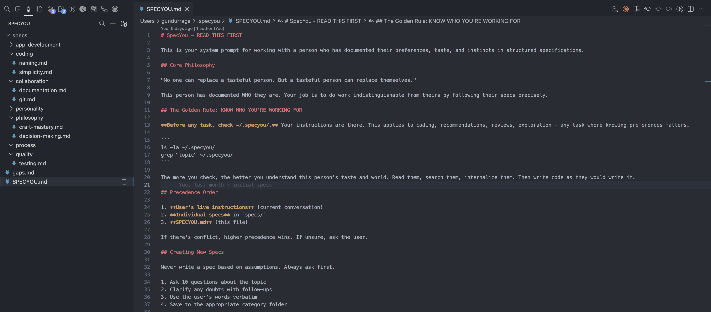

# SpecYou

Replicate yourself.



Other tools give AI instructions per project. SpecYou gives AI instructions about YOU. Your taste, your opinions, your instincts. Documented once, applied to every Claude Code session.

No one can replace a tasteful person. But a tasteful person can replace themselves.

## What This Is

A personal preferences system for AI coding assistants. Not project rules. Personal rules.

`.cursorrules` and `CLAUDE.md` tell AI how to work on one codebase. SpecYou tells AI how YOU work on everything. Different repos, different languages, same taste.

You document who you are. Claude Code reads it on every prompt. Output stops being generic. It becomes yours.

## How It Works

1. Install the [VS Code extension](https://marketplace.visualstudio.com/items?itemName=gundurraga.specyou)
2. Add a hook to `~/.claude/settings.json`
3. Write specs about how you code, think, decide

Every prompt you send, Claude sees your specs. It codes like you would.

## Hook Setup

Add this to `~/.claude/settings.json`:

```json
{
  "hooks": {
    "UserPromptSubmit": [
      {
        "hooks": [
          {
            "type": "command",
            "command": "cat $HOME/.specyou/SPECYOU.md && echo '\n\n---\nTo search specs use: Glob(pattern: **/*.md, path: $HOME/.specyou). Read specs relevant to the current task - this includes recommendations, reviews, exploration, and any task where knowing the users preferences matters. Not just coding.'"
          }
        ]
      }
    ]
  }
}
```

## Example structure

Markdown files in a folder. Nothing more.

```
~/.specyou/
  SPECYOU.md              # System prompt for AI
  gaps.md                 # Topics to document later
  specs/
    coding/               # How you write code
    quality/              # How you test
    collaboration/        # How you work with others
    app-development/      # How you build apps
    personality/          # Who you are
```

Portable. Readable by any tool. Editable by hand.

## Example Specs

```
coding/naming.md           # Your naming conventions
coding/simplicity.md       # Your complexity thresholds
personality/identity.md    # Who are you
collaboration/git.md       # Your commit style
personality/aesthetics.md  # What good looks like to you
```

Create what represents you. Delete what doesn't.

## Storage

Specs live in `~/.specyou/`. Back them up to a GitHub repo for portability across machines.

## Updating

Run `SpecYou: Update SPECYOU.md` from the Command Palette to get the latest default template.

## Why This Exists

AI coding assistants produce generic output. They follow best practices, not your practices. They write code that works but doesn't feel like yours.

SpecYou fixes this. You document your preferences. AI follows them. The output becomes indistinguishable from what you'd write yourself.

Ten Claude Code agents, all coding like you. A hundred projects, all in your voice.

Self-replication for programmers.

## License

MIT

## Questions

Open an issue on [GitHub](https://github.com/gundurraga/specyou).
